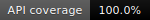

# @civitas-cerebrum/test-coverage

[)](https://www.npmjs.com/package/@civitas-cerebrum/test-coverage)

> 🔍 **Zero-tolerance API coverage enforcement for TypeScript projects.**  
> Uses TypeScript's compiler API (AST + type checker) to verify that every public method of every exported class is exercised in your test suite — at the static analysis level, before a single test runs.

---

## How It Works

The reporter runs in two passes over your TypeScript program:

1. **API Indexing** — scans your `src/` directory, finds all exported classes, and catalogs their public non-constructor methods (including arrow function properties).
2. **Call Detection** — scans your test files and uses the TypeScript type checker to find typed call expressions that resolve back to those methods. Three strategies are applied in order of precision: signature-based resolution → apparent type hierarchy traversal → name-based fallback for mocked/`as any` instances.

If every method is called at least once, the process exits `0` ✅. Otherwise it exits `1` ❌, which fails your CI build.

---

## Installation

```bash
npm install --save-dev @civitas-cerebrum/test-coverage
```

---

## Usage

### CLI

```bash
npx test-coverage
```

Reads `tsconfig.json` from the current directory, scans `src/` for the API surface, and checks `tests/` (plus any `*.spec.ts` / `*.test.ts` files) for coverage. Automatically uses the `pretty` format when run in an interactive terminal, and plain `text` when piped or run in CI.

### Programmatic

```typescript
import { ApiCoverageReporter } from '@civitas-cerebrum/test-coverage';

const reporter = new ApiCoverageReporter({
  rootDir: process.cwd(),
  srcDir: './src',
  testDir: './tests',
  outputFormat: 'pretty',
});

const allCovered = await reporter.runCoverageReport();
process.exit(allCovered ? 0 : 1);
```

### Options

| Option | Type | Default | Description |
|---|---|---|---|
| `rootDir` | `string` | `process.cwd()` | Project root (must contain `tsconfig.json`) |
| `srcDir` | `string` | `<rootDir>/src` | Where exported classes live |
| `testDir` | `string` | `<rootDir>/tests` | Where test files live |
| `ignorePaths` | `string[]` | `['node_modules', 'dist']` | Path segments to skip during scanning |
| `outputFormat` | `'pretty' \| 'text' \| 'json' \| 'html' \| 'badge' \| 'github'` | auto | See below |
| `debug` | `boolean` | `false` | 🐛 Print file discovery and call-matching trace |

---

## Output Formats

### 🎨 `pretty` (default in terminal)

Colorized ANSI output with a progress bar, per-class breakdown, and pass/fail indicators. Automatically selected when running in an interactive terminal. Falls back to `text` when piped or run in CI.

```
 ╔═════════════════════════════════════════════╗
 ║         api coverage report                 ║
 ╚═════════════════════════════════════════════╝

 overall   ████████████████████░░░░░   84.6%   11 / 13

 ─────────────────────────────────────────────

 UserService                         3 / 4
   ✔  fetchUser
   ✔  createUser
   ✔  updateUser
   ✘  deleteUser

 ─────────────────────────────────────────────

 ⚠  1 uncovered method:
    UserService.deleteUser

 ✘  build failed — coverage is not 100%
```

---

### 📄 `text`

Plain-text summary printed to stdout and saved as `test-coverage-report.txt`. Best for piped output and environments that don't support ANSI.

```
=== API COVERAGE REPORT ===

UserService: 3/4
  [x] fetchUser
  [x] createUser
  [x] updateUser
  [ ] deleteUser

OVERALL: 3/4 (75.0%)

Uncovered:
  UserService.deleteUser
```

---

### 🗂️ `json`

Machine-readable output saved as `test-coverage-report.json`. Suitable for ingestion by dashboards, custom reporters, or quality gates in other tools.

```json
{
  "summary": { "total": 4, "covered": 3, "percentage": 75.0 },
  "classes": [
    {
      "name": "UserService",
      "methods": [
        { "name": "fetchUser",  "covered": true },
        { "name": "createUser", "covered": true },
        { "name": "updateUser", "covered": true },
        { "name": "deleteUser", "covered": false }
      ]
    }
  ],
  "uncovered": ["UserService.deleteUser"]
}
```

---

### 🌐 `html`

A self-contained HTML report saved as `test-coverage-report.html`. Open it in any browser to get a visual breakdown: overall progress bar, per-class mini-bars, and color-coded method badges (🟢 covered, 🔴 uncovered).

Useful for sharing coverage snapshots with teammates who don't have the repo checked out.

---

### 🏷️ `badge`

Generates a shields.io-compatible SVG badge saved as `test-coverage-badge.svg`. Embed it directly in your README:

```markdown

```

The badge color reflects coverage tier:

| Coverage | Color |
|---|---|
| 100% | 🟢 brightgreen |
| ≥ 80% | 🟩 green |
| ≥ 60% | 🟡 yellow |
| ≥ 40% | 🟠 orange |
| < 40% | 🔴 red |

---

### 🐙 `github`

Writes a formatted Markdown summary to `$GITHUB_STEP_SUMMARY`, which renders as a table directly in the GitHub Actions run UI — no artifacts or separate files needed. Falls back to `text` if the environment variable is not set.

---

## ⚙️ CI Integration

### npm scripts

```json
{
  "scripts": {
    "test": "jest",
    "coverage:api": "test-coverage",
    "ci": "npm test && npm run coverage:api"
  }
}
```

### GitHub Actions

```yaml
- name: Run tests
  run: npm test

- name: Check API coverage
  run: npx test-coverage
  env:
    OUTPUT_FORMAT: github

- name: Upload HTML report
  if: always()
  uses: actions/upload-artifact@v4
  with:
    name: api-coverage-report
    path: test-coverage-report.html
```

---

## 🔎 What Gets Tracked

| ✅ Included | ❌ Excluded |
|---|---|
| Public methods on exported classes | `private` / `protected` members |
| Public arrow function properties | `constructor` |
| Inherited public methods | Methods prefixed with `_` |

---

## 🐛 Debugging Zero Coverage

If the API index builds correctly but coverage shows 0%, enable debug mode:

```typescript
new ApiCoverageReporter({ debug: true })
```

Common causes:

- **Test files not found** — ensure they end in `.spec.ts` / `.test.ts` or live under `testDir`.
- **`tsconfig.json` excludes tests** — the reporter automatically globs and adds test files to the TypeScript program, but verify your `testDir` path is correct.
- **Heavily mocked instances (`as any`)** — the name-based fallback covers this, but check the debug output for `[name-only match]` lines.

---

## Requirements

- Node.js ≥ 18
- TypeScript ≥ 5.0
- A `tsconfig.json` in the project root

---

## License

MIT © [Umut Ay Bora](https://github.com/civitas-cerebrum)